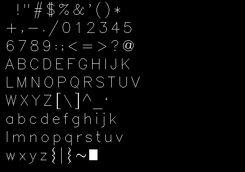
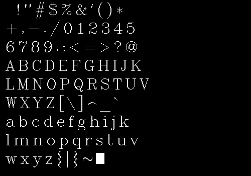
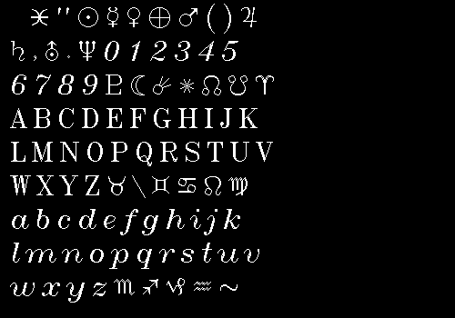

# Draft Type
A minimal Hershey vector font library.

## Usage:
To include the library in your own project, add the following lines to your CMakeList.txt:
(The library is located in `deps/draft-type`, adapt as needed)
```
set(DRAFT_TYPE_DIR deps/draft-type)
add_subdirectory(${DRAFT_TYPE_DIR})
include_directories(${DRAFT_TYPE_DIR}/include)

...

target_link_libraries(<your_target> PRIVATE draft_type)

```

#### Include the library in own project
```
#include <draft-type.h>
```

## Build and run example:
### Building with CMake
Run the following commands to build the library + example:
```
mkdir build
cd build
cmake ..
```
Building with Make:
```
make -j
```

### Running the example
Linux:
```
cd build
./draft_type_example
```

The example will generate a .ppm image dispaying all characters of the specified font (default: futural.jhf)

### Showcase:

*futural.ppm*


*timesr.ppm*


*astrology.ppm*


### Font License:
Applies to the fonts in: `assets/hershey-fonts/`
```
USE RESTRICTION:
        This distribution of the Hershey Fonts may be used by anyone for
        any purpose, commercial or otherwise, providing that:
                1. The following acknowledgements must be distributed with
                        the font data:
                        - The Hershey Fonts were originally created by Dr.
                                A. V. Hershey while working at the U. S.
                                National Bureau of Standards.
                        - The format of the Font data in this distribution
                                was originally created by
                                        James Hurt
                                        Cognition, Inc.
                                        900 Technology Park Drive
                                        Billerica, MA 01821
                                        (mit-eddie!ci-dandelion!hurt)
                2. The font data in this distribution may be converted into
                        any other format *EXCEPT* the format distributed by
                        the U.S. NTIS (which organization holds the rights
                        to the distribution and use of the font data in that
                        particular format). Not that anybody would really
                        *want* to use their format... each point is described
                        in eight bytes as "xxx yyy:", where xxx and yyy are
                        the coordinate values as ASCII numbers.
```
